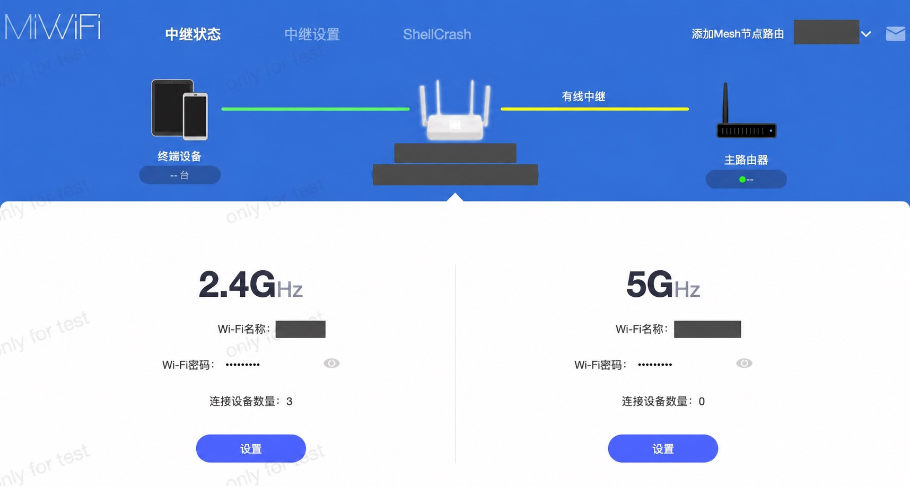
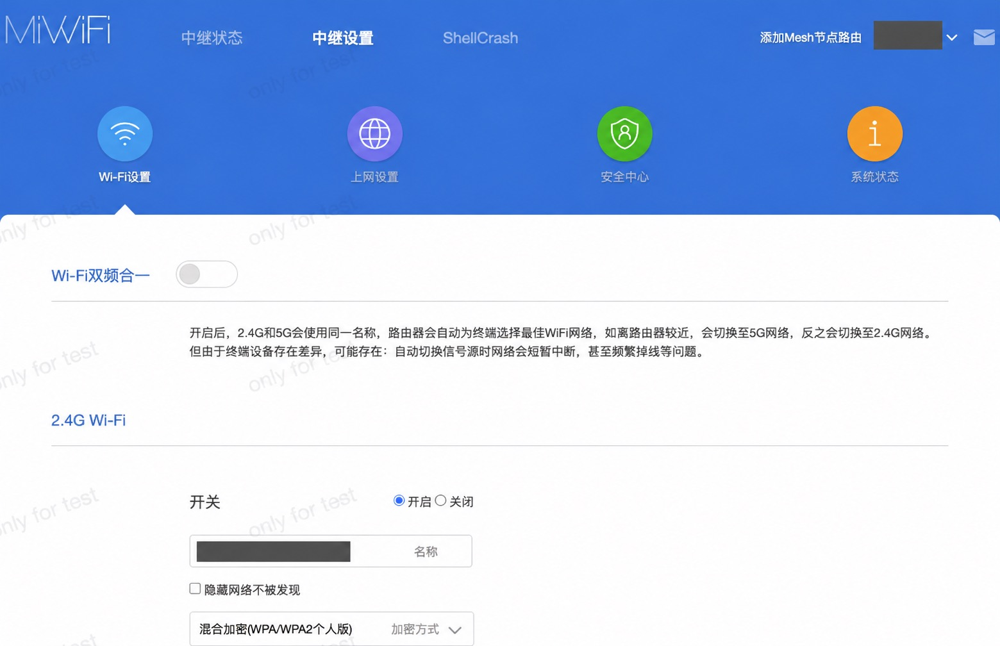
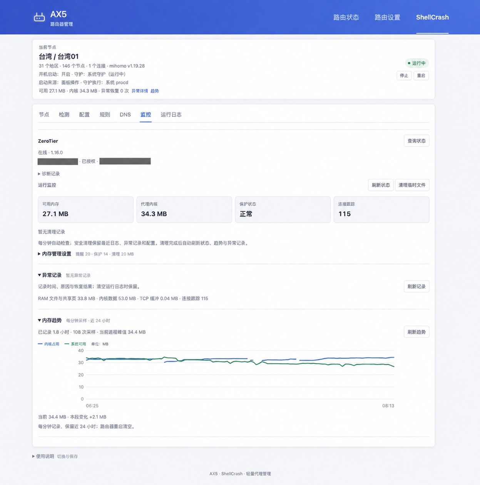

# 小米 AX5 · ShellCrash 可视化管理面板

把 ShellCrash 接入小米路由器管理页，在网页里切换节点、更新订阅、切换内核、设置 DNS，查看日志和运行状态。

适用于 **Redmi AX5 / RA67，原厂开发版 1.0.105**。其他型号和固件暂未验证。

## 安装

本项目依赖 [ShellCrash](https://github.com/juewuy/ShellCrash)。安装包包含官方 **1.9.4release** 工具和 AX5 适配脚本，首次安装会一并部署。

1. 先开启路由器 SSH，可参考 [XMiR-Patcher](https://github.com/openwrt-xiaomi/xmir-patcher)。
2. 使用 root 登录路由器，执行：

```sh
curl -fsSL https://raw.githubusercontent.com/wcbspp/XiaoMiAX5-shellcrash-panel/main/bootstrap.sh -o /tmp/ax5-panel-install.sh
sh /tmp/ax5-panel-install.sh
```

3. 登录小米管理页，点击 **ShellCrash → 配置**，填写订阅并更新，再选择节点和 DNS 模式。

小米默认管理地址为 `192.168.31.1`；修改过地址的设备使用自己的地址。面板沿用路由器登录会话，无需单独输入密码。

首次安装默认使用 sing-box 1.12.13、真实 DNS 和全直连。已有本项目的设备会更新页面和适配脚本，保留配置。遇到其他 ShellCrash 部署时，安装脚本退出，不覆盖原安装。

[下载 v1.0.2](https://github.com/wcbspp/XiaoMiAX5-shellcrash-panel/releases/tag/v1.0.2) · [手动安装与文件路径](docs/部署记录.md)

## 页面预览

ShellCrash 入口位于小米管理页顶部菜单。








## 功能

| 页面 | 功能 |
| --- | --- |
| 节点 | 地区分组、搜索、协议标识、切换节点；测速取三次成功结果中的最短值 |
| 检测 | 国内直连与国外代理网站的 HTTPS 检测 |
| 配置 | 更新订阅、切换 sing-box / Mihomo、更新 ShellCrash 正式版、设置镜像和守护方式 |
| 规则、DNS | 运行规则 / 策略组 / 连接查询、国内数据库维护、Mix / 真实 DNS 与 Fake IP 例外 |
| 监控、日志 | 内存趋势、阈值与安全清理、异常时间和原因、日志清空、ZeroTier 状态查询 |

## 订阅更新

配置页提供三种获取方式，说明随选择变化：

| 方式 | 用途 |
| --- | --- |
| 从订阅地址直接下载（默认） | 调用 ShellCrash 向填写的地址下载；失败时尝试面板直接下载 |
| 通过转换服务下载 | 通过所选 ShellCrash 转换服务获取配置，可选择失败后依次尝试其他服务 |
| 面板直接下载（兼容） | 使用面板原有下载方式，适合排查工具获取失败的问题 |

转换前会用不含订阅地址的请求预检接口，通过后才发送订阅。**转换服务来自互联网，安全性请自行斟酌。** 启用失败轮询可能向多家服务发送订阅地址；预检通过不保证转换成功。直接下载只联系填写的订阅地址。

下载后，面板整理节点并保留现有 DNS 和分流设置，生成当前内核的运行配置：sing-box 使用 JSON，Mihomo 使用 YAML。通过内核校验后保存并加载，失败保留或恢复原配置。错误提示会显示本次订阅地址、出错接口和尝试记录。

支持 AnyTLS、Base64 和 sing-box JSON 节点，以及兼容的 origin/plain、origin/http_simple SSR 链接。兼容 SSR 按 SS（带所需混淆）运行，协议标识显示 SS；其他 SSR 需要 Mihomo，sing-box 会提示未导入数量。转换暂以 sing-box JSON 为中间格式，仅 Mihomo 支持的字段可能无法完整保留；当前未接入 ShellCrash 的 providers 本地生成流程。

当前订阅导入只更新节点，不导入订阅文件中的策略组、分流规则或 rule-providers。已有 DNS 与分流设置由面板保留；转换服务生成的完整规则目前不会生效。内核本身支持更复杂的规则，但本面板尚未提供完整配置导入与编辑。

## 启动、备份与规则

面板与 `crash` 管理同一个代理服务。首页显示开机启动、启动来源和守护状态；配置页可切换系统 procd 守护或每分钟检测，每次只启用一种。

重启优先解压本地内核包，校验失败再从自定义镜像和 ShellCrash 工具源恢复。配置单独保存在 `/data/ShellCrash/configs/`，恢复内核不会覆盖配置。手动更新成功后保存本地文件；配置了镜像上传时会尝试同步，失败提示待重试。

国内分流使用国内 IP 网段和国内域名库，无需安装未引用的完整 GeoSite。Mix 模式对国内域名和例外名单返回真实地址，其余返回 Fake IP；返回真实地址不等于强制直连，流量仍按规则分流。

[与 ShellCrash 的关系](docs/与ShellCrash的关系.md) · [数据库与规则](docs/数据库与规则.md) · [镜像配置](docs/镜像接收器.md) · [Mixbox 与 ZeroTier](docs/Mixbox与ZeroTier.md)

## 测试与许可

实机测试覆盖 sing-box 1.12.13 / Mihomo v1.19.28 切换、订阅更新、DNS 例外、国内分流、重启恢复及守护切换。其他固件和长期高负载仍需单独验证。[测试记录](docs/验证记录.md) · [变更记录](CHANGELOG.md)

发布包不包含私人订阅、密码、设备身份或运行配置。组件许可见 [LICENSE](LICENSE) 和 [NOTICE](NOTICE)。

规则页可筛选、分页查看内核实际加载的规则、策略组和连接。查询按需执行，不增加后台轮询。[轻量页面验证记录](docs/轻量页面验证.md)
