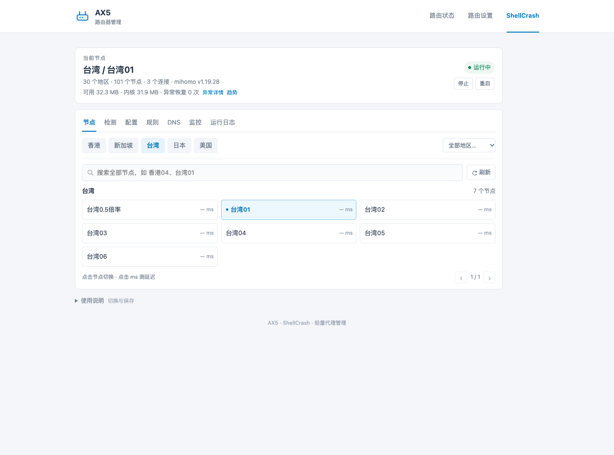
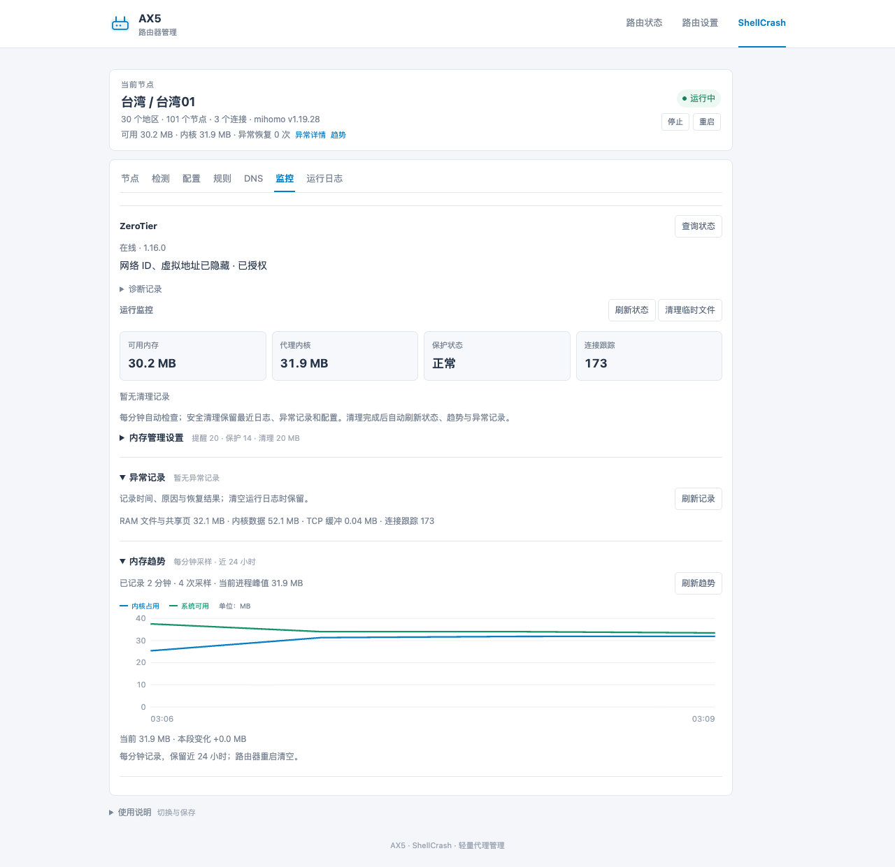

# 小米 AX5 · ShellCrash 可视化管理面板

在小米路由器管理页中切换节点、更新订阅、管理内核和规则，查看 DNS、日志与运行状态。

**需要 ShellCrash 工具。** 本项目基于 [juewuy/ShellCrash 官方仓库](https://github.com/juewuy/ShellCrash)，不是独立代理程序。自动安装会先部署已验证的官方 **1.9.4release**，再安装面板和 AX5 适配层；已有本项目的设备只更新面板源码。

## 安装

适用 **Redmi AX5 / RA67，原厂开发版 1.0.105，已解锁 SSH**。其他型号和固件暂未验证。以 root 登录路由器后执行：

```sh
curl -fsSL https://raw.githubusercontent.com/wcbspp/ax5-shellcrash-panel/main/bootstrap.sh -o /tmp/ax5-panel-install.sh
sh /tmp/ax5-panel-install.sh
```

脚本自动区分首次安装和本项目更新，核对固件、依赖、空间及安装包。首次安装使用 sing-box 1.12.13、真实 DNS、全直连；完成后进入配置页填写**自己的订阅**，再选择 DNS 模式。不会附带他人的节点或密码。

已有其他 ShellCrash 部署时，脚本会停止并保留配置，不强行接管。手动安装、预检和迁移限制见[安装说明](docs/部署记录.md)。[下载 v1.0.0](https://github.com/wcbspp/ax5-shellcrash-panel/releases/tag/v1.0.0)

小米默认管理地址为 `192.168.31.1`。登录后点击 **ShellCrash**，沿用路由器登录会话，无需另设面板密码。改过地址则使用自己的地址。

## 页面预览

包含路由器导航；截图中的 ZeroTier 网络信息已隐藏。





## 日常使用

| 页面 | 功能 |
| --- | --- |
| 节点、检测 | 切换节点、三次测速取最短值、网站连通检测 |
| 配置 | ShellCrash 订阅读取／转换、内核切换、正式版工具更新、自定义镜像 |
| 规则、DNS | 国内 IP 和域名库更新、Fake IP 真实地址例外 |
| 监控、日志 | 内存阈值、安全清理、异常与恢复记录、按需 ZeroTier 状态 |

订阅转换使用 `crash` 中选定的转换服务，会把订阅链接发送给该服务；不会在失败时自动转发给其他服务。直接读取仍保留原读取方式作为兜底。候选配置校验和启动检查通过后才完成更新；失败保留或恢复旧配置。

服务操作经 ShellCrash 入口进入统一的 AX5 服务，内核和数据库下载复用工具源。设备适配层负责配置校验、内存保护、本地缓存、备份回退与状态核对。[与 ShellCrash 的关系](docs/与ShellCrash的关系.md)

重启优先解压本地内核包，失败再从镜像和工具源恢复。配置单独保存在路由器中，更新内核不会覆盖；手动更新会尝试同步镜像，失败会提示。镜像不是启动前置条件。

当前使用国内域名库和国内 IP 网段，无需完整 GeoSite。[数据库说明](docs/数据库与规则.md) · [Mixbox 与 ZeroTier](docs/Mixbox与ZeroTier.md)

## 验证

已验证 sing-box 1.12.13 / mihomo v1.19.28 切换、本地恢复、DNS 例外及国内分流。首次安装模板通过实机 ARMv7 内核校验；更新安装脚本已在现有设备执行并保留运行服务，未清空现有设备进行全新安装。长期高负载仍需观察。[测试记录](docs/验证记录.md) · [变更记录](CHANGELOG.md)

公开包不含私人订阅、密码、设备身份或运行配置。组件许可见 [LICENSE](LICENSE) 和 [NOTICE](NOTICE)。
