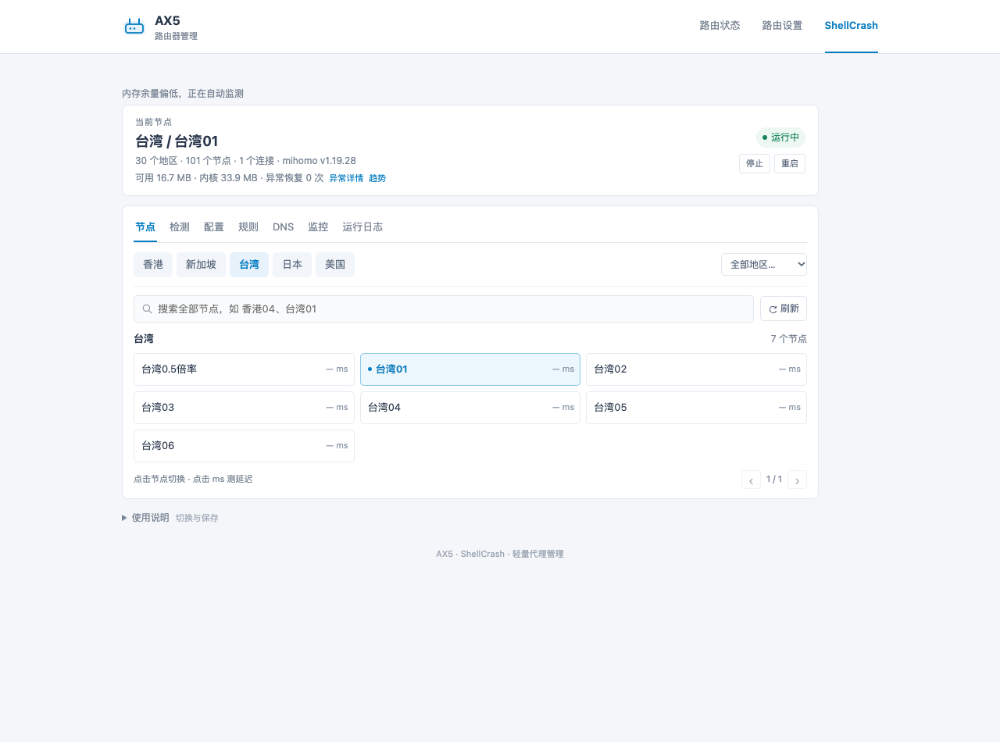
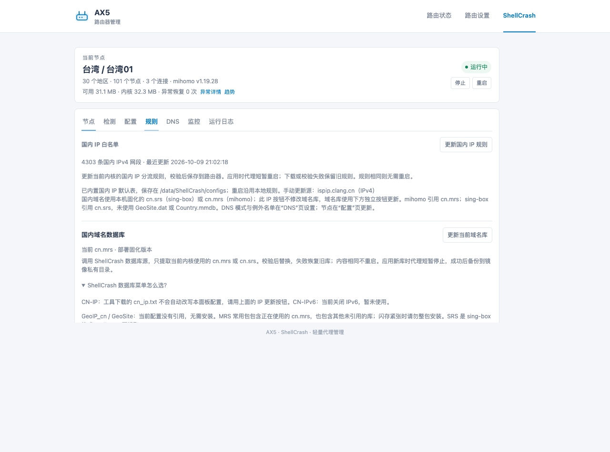

# AX5 原厂固件适配

适用本次验证的 Redmi AX5 / RA67 开发版 1.0.105。包含页面、LuCI 后端、sing-box / mihomo 的统一 procd 启动适配和 Mixbox ZeroTier 修复脚本。

这是本次部署的源码记录，不是任意 OpenWrt 设备的一键安装包。完整部署需要匹配的 ARMv7 内核包、分流配置、规则和代理订阅；公开目录不附带私人配置。部署与测试说明见[部署记录](docs/部署记录.md)。

## 使用前确认

这套代码要求已解锁 SSH 的上述 AX5 固件，具备 Lua/cjson、LuCI、procd、iptables、openssl、下载工具和 ShellCrash 1.9.4release。它不负责解锁、刷机或生成 ZeroTier 身份。当前配置格式以 sing-box JSON 为保存基准，mihomo 运行配置由适配层生成。

首次部署还需准备 configs/config.json、configs/enabled、cache/core.env、与哈希匹配的 ARMv7 内核压缩包，以及 cn.srs / cn.mrs。请先看部署记录中的目录表；公开包不附带这些私人运行文件。不要直接把未配置的目录复制过去并启动服务。

## 只更新页面或后端源码

将 `ax5/` 和 `ui/` 放入 `/data/ShellCrash/`，同步 `ax5/controller.lua` 到 `/usr/lib/lua/luci/controller/web/shellcrash.lua`，`ax5/view.htm` 到 `/usr/lib/lua/luci/view/web/shellcrash.htm`。更新启动服务时再同步 `ax5/shellcrash.init` 到 `/etc/init.d/shellcrash`。不要替换 configs 或缓存内核。复制后执行 `chmod 755 /data/ShellCrash/ax5/*.sh`；服务脚本需要 `chmod 755 /etc/init.d/shellcrash`。普通页面更新无需重启代理。

ZeroTier 修复文件 `zerotier/zerotier.sh` 对应 `/etc/mixbox/apps/zerotier/scripts/zerotier.sh`。`zerotier/local.conf` 对应其程序数据目录内的 local.conf；若原文件已有其他设置，合并 settings.portMappingEnabled=false，不能直接覆盖。设备身份和网络 ID 不在公开源码中。

## ShellCrash 工具入口

实际工具保存在 `/data/ShellCrash-tool`，执行 `crash` 打开。启停、内核切换已接入同一 AX5 服务。网页“配置”页也能切换。源解析沿用 ShellCrash，自定义源在其“更新与支持 → 切换安装源”菜单维护。

`tool-patches/` 记录针对上游 1.9.4release 的修改：start/init 使用统一服务、配置路径连接现有配置、core_check 调用可回退的固化流程，避免原生脚本更新覆盖适配层。该目录不包含上游完整工具；本机私有恢复备份含已部署工具。

## 版本与来源

前端改编自 wcbspp/padavan-shellcrash-panel v1.0.2，项目许可见 LICENSE。已验证 ShellCrash ARMv7 mini 1.12.13 与 mihomo v1.19.28；当前 mihomo 包对应上游提交 `21734eca91ec7a540494a5f43eac485403c18dac`。二进制不改动；组件许可证各自适用。参见 NOTICE。

## 数据库与规则

见[数据库与规则](docs/数据库与规则.md)。当前 mihomo 使用 cn.mrs 和配置中的国内 IPv4 网段，未使用 GeoSite.dat / Country.mmdb。规则页分别提供国内 IPv4 和当前内核国内域名库更新；工具里的整包数据库并非全部需要安装。

## 本版行为

配置页可检查和更新官方正式版工具、切换内核及维护镜像。启动沿用已安装版本：验证本地包，失败再走配置的镜像和固定提交的工具源，不查询最新版本。切换到已验证过的另一内核时优先使用保存的版本与哈希，从镜像取包，失败再取固定工具源。工具版本索引可能对应其他构建，运行版本以程序实测为准。手动成功更新后保存本地包并回传镜像；云端同步失败单独显示，可重试。

AX5 闪存只容纳一套当前内核包，因此真正替换前必须先确认旧包的云端回退副本可用；云端不可达时拒绝替换，仍保留当前服务。当前正式工具与已安装版本相同，没有进行实机跨版本升级；未来版本如修改了适配依赖文件会拒绝覆盖，需先更新适配。

节点测速顺序采样三次，显示成功样本最短值。ZeroTier 状态与最近诊断按需读取，无新增常驻进程。SSH 登录环境减轻了 Mixbox 初始化工作；历史首连退出未复现，不能认定原因已解决。
